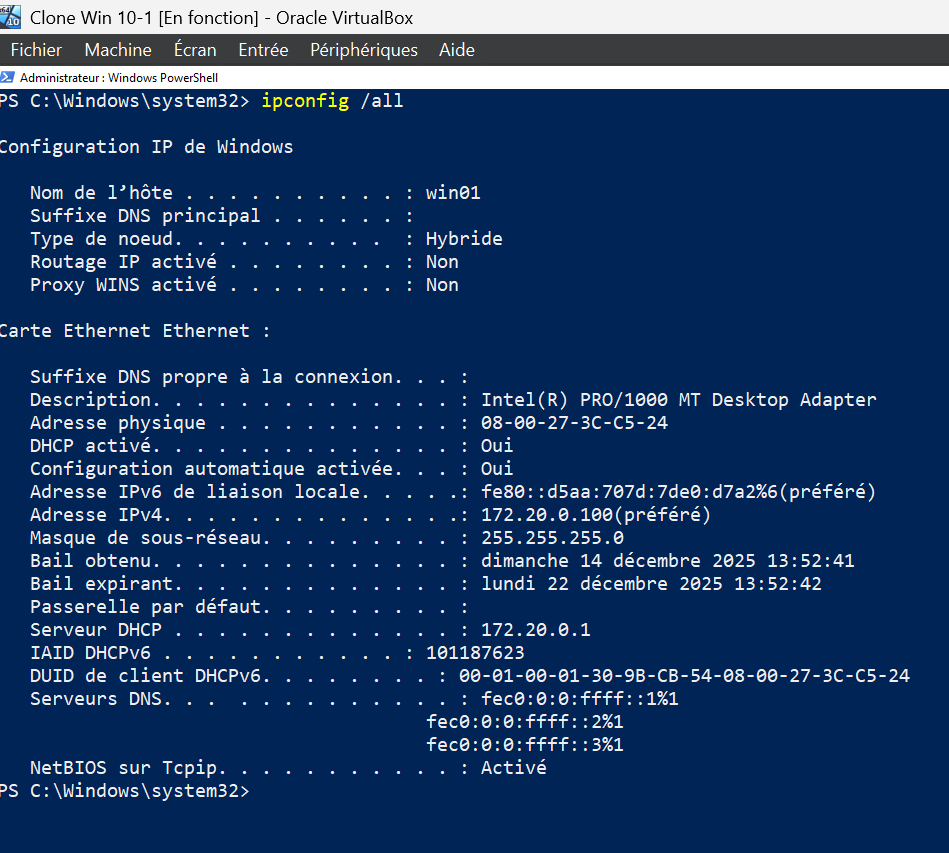
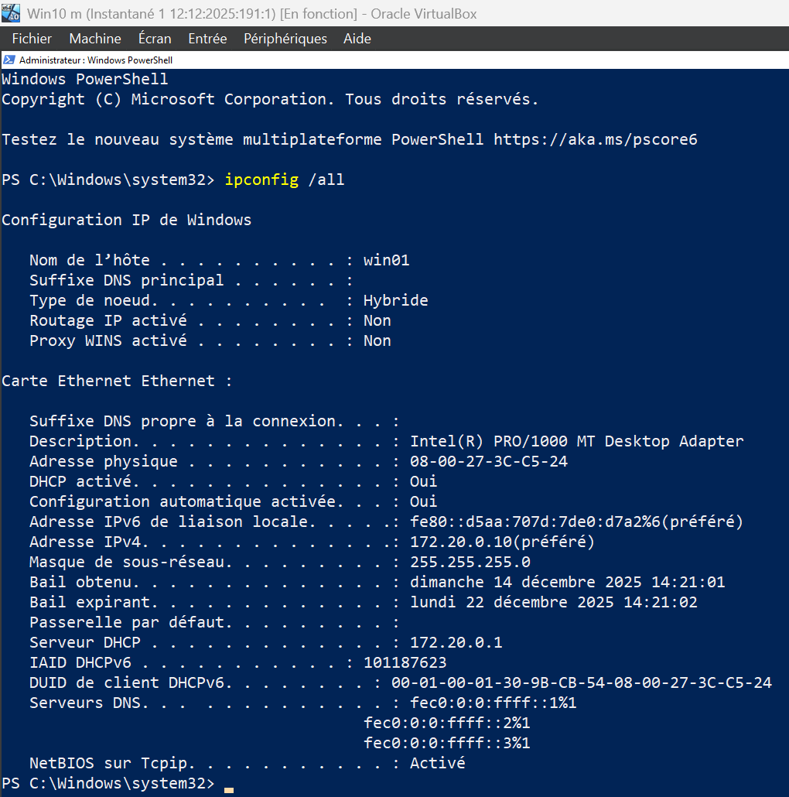

### Configuration DHCP

- **Réseau :** 172.20.0.0/24
- **Serveur DHCP :** 172.20.0.1
- **Étendue DHCP :** 172.20.0.100 -> 172.20.0.200
- **Réservation :** 172.20.0.10

#### IP Address Range:

 

### Configuration IP du Client 1

 

---

### Configuration IP du Client 2 Reservation

 

 
